In analysis, it's helpful to simplify and focus on the core elements of a
system. Today, we will identify the essential processes and structures
required to create a functional bank, accompanied by diagrams to
illustrate these key processes.

---

## 1. Loan Creation

Banks operate on the fundamental principle that **loans create
deposits**.  When a bank advances a loan to Person A, it simultaneously:

- **Credits** an advance into Person A's bank account (a liability for the bank)
- **Debits** a loan note of the same value (an asset for the bank)

```mermaid
flowchart TD
    %% Nodes
    subgraph "🏦 Bank"
        BankSystem("Bank Processing"):::bank
        LoanNote("📜 Loan Note (Asset)"):::asset
        A("💰 Person A's Account (Liability)"):::liability
    end
    
    %% Edges
    BankSystem -->|Creates Loan| LoanNote
    BankSystem -->|Creates Advance| A
    A -->|Deposit Liability| BankSystem
    LoanNote -->|Loan Asset| BankSystem
    
    %% Styling
    classDef bank fill:#B2DFDB,stroke:#00897B,stroke-width:2px;
    classDef asset fill:#BBDEFB,stroke:#1976D2,stroke-width:2px;
    classDef liability fill:#FFE0B2,stroke:#FB8C00,stroke-width:2px;
```

At this stage, Person A has a deposit in their bank account that can
be used to make payments. When a loan or advance is issued, the bank's
balance sheet expands as its assets and liabilities increase.

---

## 2. Deposit Transfers

If Person A decides to pay Person B, the bank processes the transaction:

- **Debit** Person A's account
- **Credit** Person B's account

```mermaid
flowchart LR
    %% Nodes
    subgraph "🏦 Bank"
        BankSystem("Bank Processing"):::bank
        A("💰 Person A's Account"):::liability
        B("💰 Person B's Account"):::liability
    end
    
    %% Edges
    A -- Debit --> BankSystem
    BankSystem -- Credit --> B
    
    %% Styling
    classDef bank fill:#B2DFDB,stroke:#00897B,stroke-width:2px;
    classDef liability fill:#FFE0B2,stroke:#FB8C00,stroke-width:2px;
```

The deposit remains within the bank, but its ownership changes. Importantly that is all a bank liability can ever do - change ownership.

---

## 3. Interest Payments

When it comes time to pay interest or fees, the bank transfers money from Person A to Person O (the owner/operator of the bank):

- **Debit** Person A's account
- **Credit** Person O's account

```mermaid
flowchart LR
    %% Nodes
    subgraph "🏦 Bank"
        BankSystem("Bank Processing"):::bank
        A("💰 Person A's Account"):::liability
        O("💰 Person O's Account"):::profit
    end
    
    %% Edges
    A -- Debit --> BankSystem
    BankSystem -- Credit --> O
    
    %% Styling
    classDef bank fill:#B2DFDB,stroke:#00897B,stroke-width:2px;
    classDef liability fill:#FFE0B2,stroke:#FB8C00,stroke-width:2px;
    classDef profit fill:#F8BBD0,stroke:#C2185B,stroke-width:2px;
```

This is the bank's profit mechanism - the reward the owner gets for assessing and granting loans at risk.

---

## 4. Loan Repayment

When Person A repays the principal of the loan:

- **Debit** Person A's account
- **Credit** the loan note (reducing its size)

```mermaid
flowchart TD
    %% Nodes
    subgraph "🏦 Bank"
        BankSystem("Bank Processing"):::bank
        A("💰 Person A's Account"):::liability
        LoanNote("📜 Person A's Loan Note"):::asset
    end
    
    %% Edges
    A -- Debit --> BankSystem
    BankSystem -- Credit --> LoanNote
    
    %% Styling
    classDef bank fill:#B2DFDB,stroke:#00897B,stroke-width:2px;
    classDef asset fill:#BBDEFB,stroke:#1976D2,stroke-width:2px;
    classDef liability fill:#FFE0B2,stroke:#FB8C00,stroke-width:2px;
```

The bank's balance sheet shrinks as its assets (loan notes) and liabilities (deposits) both decrease.

---

## 5. Loan Default

If Person A cannot repay the loan, the loss is distributed across all deposit accounts (except for Person O's):

- The amount written off is **credited** against Person A's loan note
- The same amount is **debited pro-rata** across all deposit accounts (Person B, Person C, Person D, Person E)

```mermaid
flowchart TD
    %% Nodes
    subgraph "🏦 Bank"
        BankSystem("Bank Processing"):::bank
        LoanNote("📜 Person A's Loan Note"):::asset
        B("💰 Person B's Account"):::liability
        C("💰 Person C's Account"):::liability
        D("💰 Person D's Account"):::liability
        E("💰 Person E's Account"):::liability
    end
    
    %% Edges
    LoanNote -- Write-off Processed by Bank --> BankSystem
    BankSystem -- Distributes Loss --> B
    BankSystem -- Distributes Loss --> C
    BankSystem -- Distributes Loss --> D
    BankSystem -- Distributes Loss --> E
    
    %% Styling
    classDef bank fill:#B2DFDB,stroke:#00897B,stroke-width:2px;
    classDef asset fill:#BBDEFB,stroke:#1976D2,stroke-width:2px;
    classDef liability fill:#FFE0B2,stroke:#FB8C00,stroke-width:2px;
```

The bank's depositors indirectly bear the cost of defaults.

---

## 6. Owner Consumption

The bank owner (Person O) needs to eat as well. They pay for goods and services by transfer from their account in the usual way:

- **Debit** Person O's account
- **Credit** Person C's account

```mermaid
flowchart LR
    %% Nodes
    subgraph "🏦 Bank"
        BankSystem("Bank Processing"):::bank
        C("💰 Person C's Account"):::liability
        O("💰 Person O's Account"):::profit
    end
    
    %% Edges
    O -- Debit --> BankSystem
    BankSystem -- Credit --> C
    
    %% Styling
    classDef bank fill:#B2DFDB,stroke:#00897B,stroke-width:2px;
    classDef liability fill:#FFE0B2,stroke:#FB8C00,stroke-width:2px;
    classDef profit fill:#F8BBD0,stroke:#C2185B,stroke-width:2px;
```

Like other profits, owners use interest received to transfer goods and
services to themselves. When they pay for goods and services, that money
goes back into the system, allowing borrowers to use the money to pay
interest again in the future.

## The Bank's Profit Strategy

And that's all that is required to create an operational bank. Looking
at these processes, we can quickly see what the bank's strategy will be:

- **Demand as much physical collateral as possible** to cover the loan. 
- **Charge as much interest as possible** on loans
- **Pay as little as possible** on deposits (ideally nothing if there is no competition)

The bank's approach benefits the owner at the expense of depositors. It
favours stable assets, like land and gold, as collateral.

---

## **Conclusion**

A basic bank generates profits by issuing loans and charging fees and
interest. When borrowers fail to repay these loans, depositors face
losses. Banks maximise their earnings, when there is no competition
or the ability to convert bank money into other assets, while
providing minimal returns to depositors.

Despite this, the process holds significant value, allowing individuals
and businesses to utilise substantial assets to develop new production
methods without first selling them.

The regulatory trick is to enhance this basic framework, retaining the
benefits while minimising the downsides.


